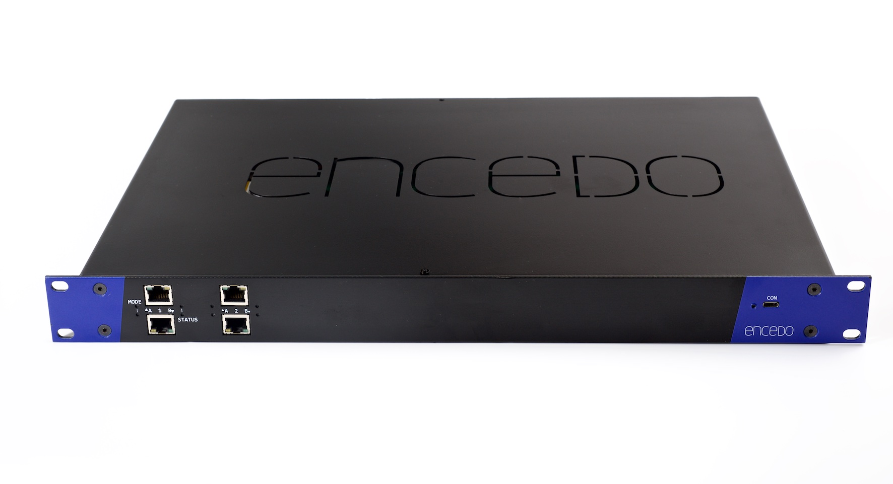

# Welcome

## Welcome to Encedo HEM API

Welcome to Encedo HEM API! Encedo HEM is a commercial version of the Common Criteria certification pending product `Encedo nGINE HSM v1.0`.&#x20;

The Encedo HEM is a general-purpose, natively Internet-oriented hardware security module (HSM) that provides advanced key management and basic cryptography functions, operating on the keys it manages. The HEM communicates with host systems through its network interface (Ethernet over a USB connection) and supports RESTful HTTP(s) based API.&#x20;

There are two possible configurations (physical implementation) on the market:

* Encedo PPA (Personal Privacy Assistant), USB thumb drive size form factor, and&#x20;
* Encedo EPA (Enterprise Privacy Appliance), 19” rack mount network appliance.

## The version of this documentation

This documentation is for `Encedo nGINE v.1.0` and is a part of a Common Criteria _"Guidance documentation"_ (AGD) and covers all API operations.&#x20;

This API is in version v1, and all endpoints, parameters, arguments, return data, or error codes are persistent.

The certified configuration version is listed [here](preliminary/quick-start.md#validate-firmware-version).

Version: 1.6 (22.10.2025)

## Disclaimer

Think of Encedo HEM as your digital front-door key. Without it, your most valuable assets remain locked away. DO NOT LEAVE YOUR ENCEDO HEM UNATTENDED.

## Want to jump right in?

Feeling like an eager beaver? Jump into the quick-start docs and get making your first request:


[quick-start.md](preliminary/quick-start.md)


## Want to get general information?

Get general information first before deep diving into API details.


[general-information.md](preliminary/general-information.md)


## Want to deep dive?

Dive a little deeper and start exploring our API reference to get an idea of everything that's possible with the API:


[api-reference](reference/api-reference/)


## Have you found a bug?

Do not hesitate to contact us! Here is how to do this securely.


[report-an-issue.md](security/report-an-issue.md)

